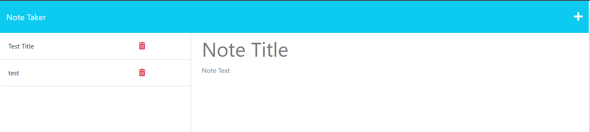
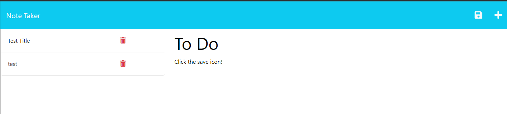
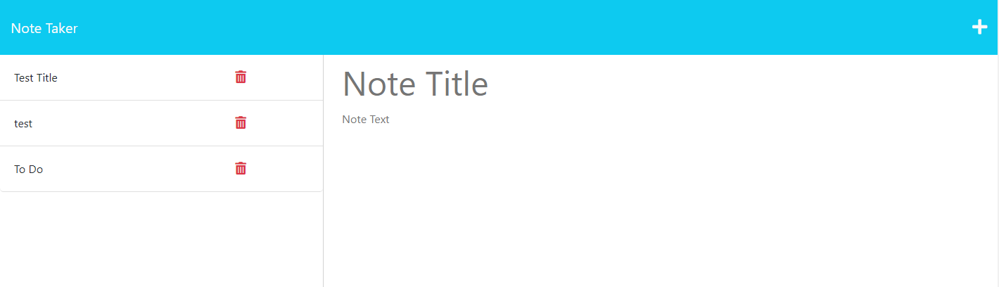
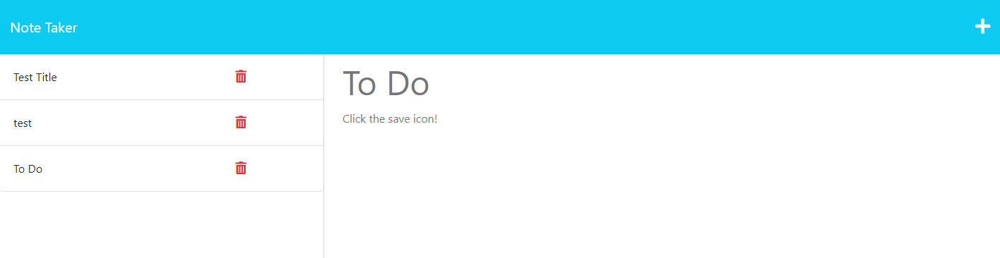

# Note Taker

## Table of Contents

- [Project description](#Description)
- [Usage](#Usage)
- [Installation](#Installation)
- [Contributing](#Contributing)
- [Tests](#Tests)
- [Questions](#Questions)
- [Project License](#License)

## Description

Take and save notes using this app.

## Usage

View the deployed app here [Note-Taker](https://protected-shore-82893.herokuapp.com/).
Click where it say 'Note Title' to give your not a title, then click where it says 'Note Text'
and enter you note.

Once you have typed out your note click the save icon to save your note.

Once your note is saved it will appear in the left column.

You can click on your saved note to view it any time.

## Installation

None

## Contribute

N/A

## Tests

N/A

## Questions

You can reach me with any questions below.

- [GitHub](https://github.com/Radioactive-mtb)
- Email - justen27@live.com

## License

This project is covered under the MIT license.
[MIT](https://choosealicense.com/licenses/mit)
